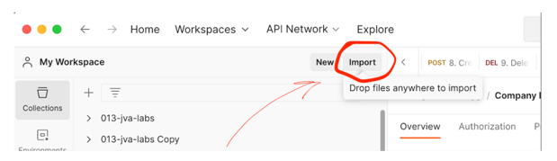
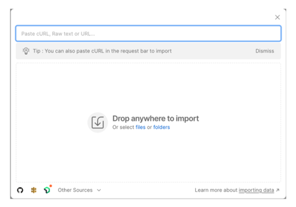
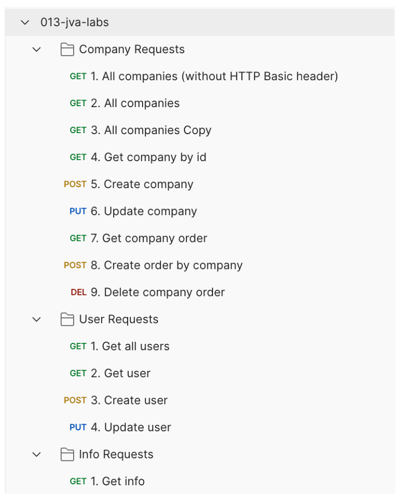

# Инструкция загрузки коллекции в Postman
## 1. Откройте Postman
## 2. В левом верхнем углу нажмите на кнопку import

## 3. После этого у вас откроется следующее окно

## 4. Перенесите в это окно файл **013-jva-labs.postman_collection.json**
## 5. После этого у вас должна появиться коллекция

