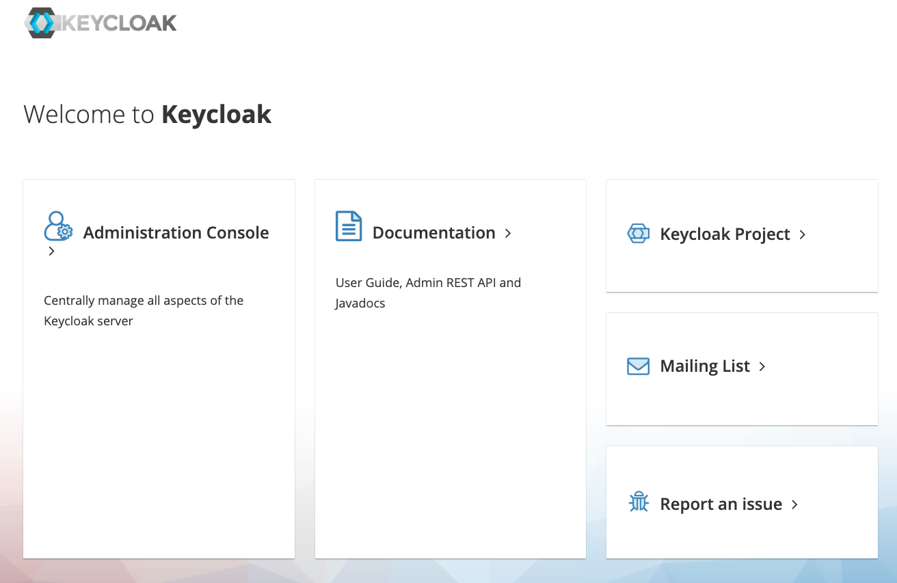

### Запуск Keycloak

Запускаем скрипт [docker_compose_up.sh](scripts/docker_compose_up.sh)
```shell
cd scripts
sh docker_compose_up.sh
```
После запуска приложения можно открыть Keycloak по [ссылке](http://localhost:18080/)



---------------

Для **остановки** docker окружения можно запустить скрипт [docker_compose_stop.sh](scripts/docker_compose_stop.sh)
```shell
cd scripts
sh docker_compose_stop.sh
```

Для **удаления** docker окружения можно запустить скрипт [docker_compose_down.sh](scripts/docker_compose_down.sh)
```shell
cd scripts
sh docker_compose_down.sh
```